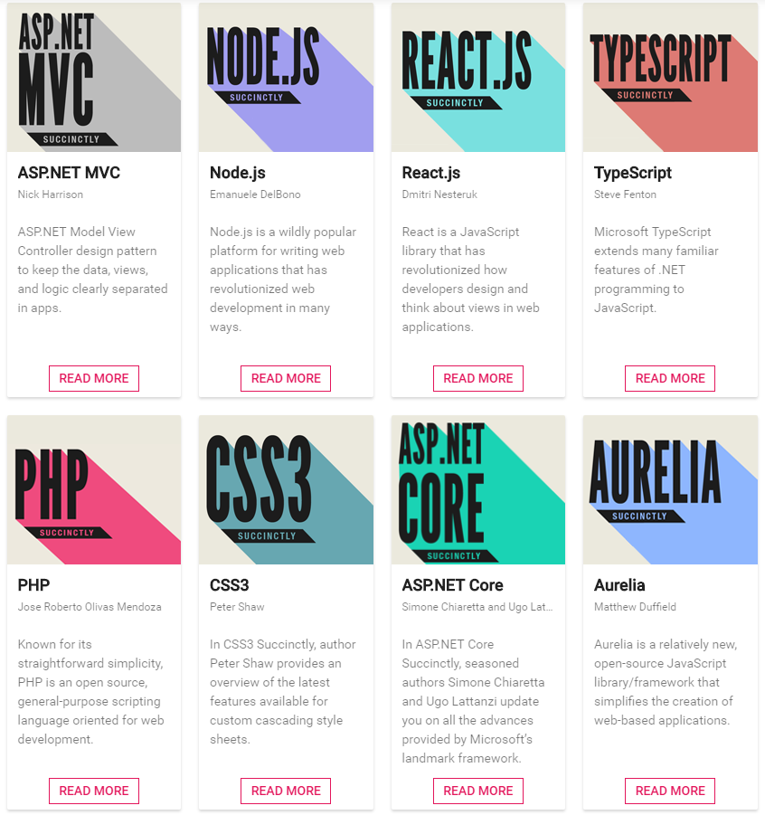

# 2. Proyecto 

## 2.0. Lugar de realización
La empresa seleccionada como ya he mencionado es Aitex.

## 2.0.0. Sobre la empresa
Se trata de una asociación de carácter privado sin ánimo de lucro, conocida por ser un importante instituto tecnológico textil, cuyo objetivo primordial es mejorar la competitividad del sector.

Se fomenta la modernización y el uso e introducción de nuevas tecnologías a través de proyectos de I+D+I. Además, promueve el hecho de que cualquier persona o empresa pueda asociarse a este instituto.

Posee representación en varios países y continentes, disponiendo de sucursales en países como Atlanta, Bogotá, Onteniente, Puebla, Shanghái, Sao Paulo… Entre otras.

### 2.0.1. Tecnología
Principalmente la manera de trabajar en la empresa es mediante licencias Microsoft. La mayor parte si no casi la totalidad de los programas que aquí se utilizan emplean dicha licencia, un ejemplo sería Office 365. Esto por supuesto lleva a utilizar la nube para trabajar con los datos que ellos utilizan.

El apartado enfocado a la estructura de red quedaría resumido en esta imagen:

(Imagen 1: Estructura de red de la empresa por plantas)

## 2.1. Motivos del proyecto
Como bien he dicho, el poder realizar un proyecto con herramientas y tecnologías con las cuales no había trabajado me pareció mejor idea que tal vez realizar uno con conceptos ya vistos en clase. Sobre todo, por el hecho de que aquí se están utilizando programas, lenguajes y herramientas que realmente se emplean fuera, en el mercado laboral y que es lo que las empresas reclaman o buscan.

Teniendo en cuenta estos aspectos, vi más ventajas en aprender cómo funciona la manera de trabajar en la empresa, aunque al principio tuviera que pasar un periodo de formación más largo. Pese a esto me parece que tomé la mejor decisión ya que he aprendido muchos nuevos conceptos.

## 2.2. Descripción del proyecto.
El proyecto que se me planteó a realizar en la empresa consistía en realizar un componente al que poder efectuar una serie de pruebas o test y así comprobar la calidad del código programado. Básicamente se trata de un testeo de aplicación web con diferentes herramientas las cuales se explican más adelante.

Al principio no conocía exactamente sobre qué archivos trabajaría y cuál sería la finalidad del proyecto que iba a llevar a cabo, pero hoy en día tras haberlo finalizado si puedo explicar en qué consiste y cuál es su funcionamiento.

La idea principal es preparar un componente que se encargue de mostrar con una vista distinta a la actual diferentes reportes que posee la empresa, cada uno con sus datos y sus características. La vista que actualmente poseen para visualizar dichos reportes se encuentra en forma de tabla, con una cabecera que divide la tabla en los campos que se mostrarán y las filas que poseen la información a mostrar de cada reporte. Adjunto imagen a continuación:
 

(Imagen 2: Imagen para mostrar donde adaptar el componente)

Como podemos observar, además de los campos, encontramos una barra de búsqueda que tiene también la finalidad de poder filtrar los reportes según nuestros intereses. Observamos como campos de la tabla además un icono que nos indica el estado del reporte, para saber si este se encuentra finalizado o en proceso. Junto a este tenemos tres iconos más los cuales permiten llevar a cabo distintas acciones las cuales se explicarán más adelante. Esto sería lo más remarcable de la imagen superior.

## 2.3. Objetivo general del proyecto.
Los principales objetivos que se aspiran a cumplir de cara a la realización de este trabajo son los siguientes:

-   Aprender a trabajar con las tecnologías que se me han enseñado en la empresa durante el tiempo que he estado en ella. Comprender su funcionamiento y saber aplicarlas a casos reales de uso.

-   Preparar el diseño del componente, concretar como será y que funcionalidades tendrá.

-   Desarrollar el componente para que en un futuro próximo pueda tener un uso útil dentro de la empresa.

-   Testear dicho componente ya que se trata de una de las partes más importantes de mi periodo de prácticas aquí. Con esto se comprobará la calidad del código.

## 2.4. Finalidad y posibles usos.
Como ya he mencionado, la idea es hacer un componente funcional. El objetivo de este es simple ya que se encargará de proporcionar la posibilidad de tener diferentes maneras de visualizar los reportes dentro de la página que se quiera implementar. También se está teniendo en cuenta la oportunidad de adaptarlo a otros apartados de la empresa, para que no solo pueda utilizarse en la tabla en cuestión. Además, en caso de visualizar los reportes desde un dispositivo móvil, creemos que con esta vista se puede facilitar la navegación a través de la página. Resulta mucho más visual e intuitiva manteniendo las funcionalidades mostradas en el formato de tabla. Posible muestra de cómo debe quedar:

(Imagen 3: Ejemplo de posible resultado)
La idea sería que el resultado fuera algo similar a esto, con la diferencia de que se trata de un trabajo más serio y no tendrá tanto color. Se encargará de poder llevar a cabo simplemente las funcionalidades básicas.

## 2.5. Apartados a tratar
Ahora pasaré a explicar todas las tecnologías que se han empleado durante la realización del proyecto pero encima, sin entrar mucho en materia más que con una definición para cada una de ellas y tras esto pasaré a dar una explicación más extensa de mi componente y la implementación de estas tecnologías en mi proyecto, como han afectado, problemas que me han surgido con ellos y para finalizar un apartado de conclusiones, inquietudes, así como los problemas que he tenido en general y una webgrafía con las páginas más importantes utilizadas.
