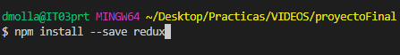
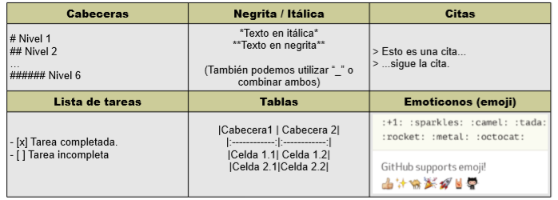
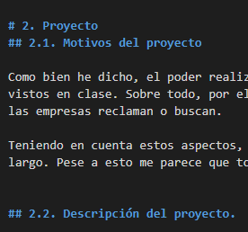
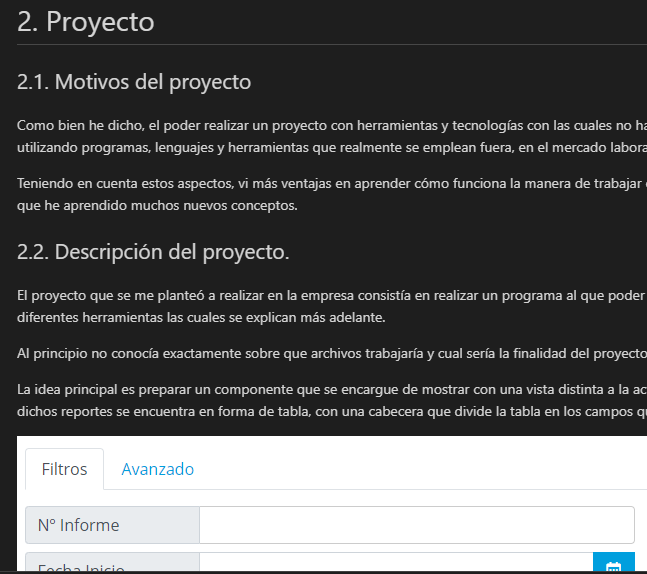
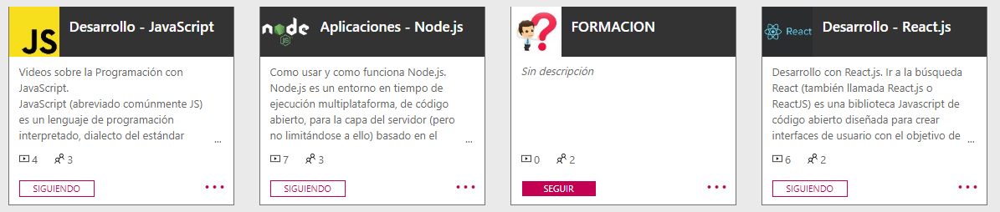
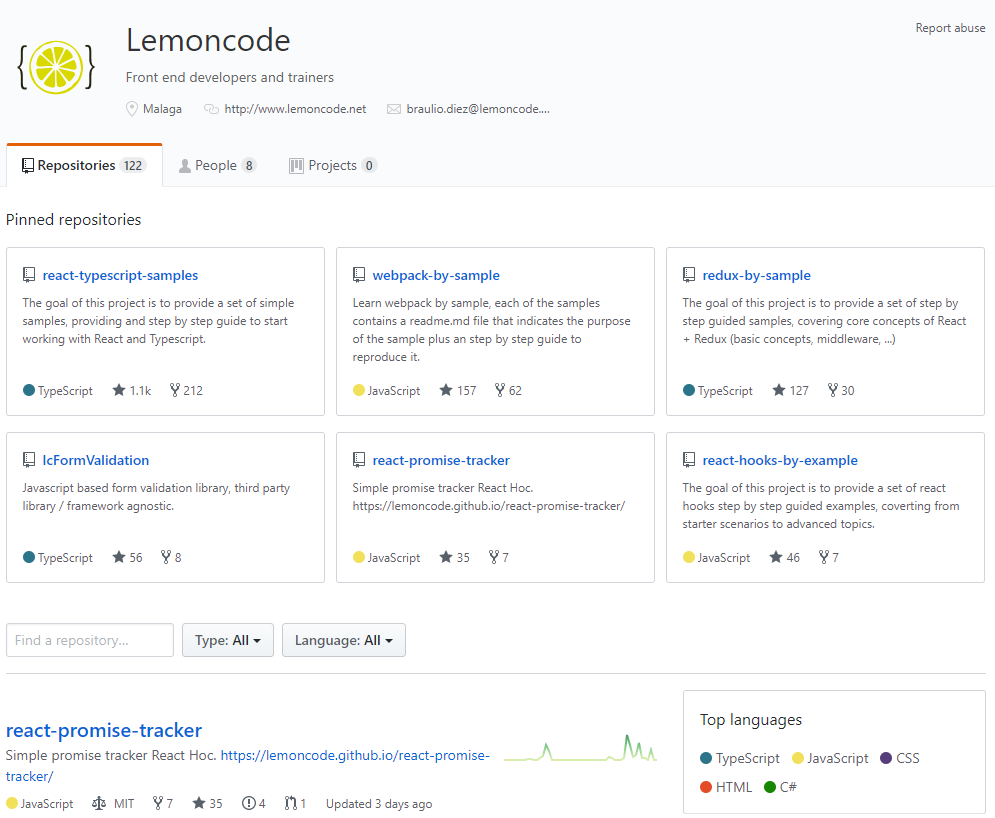
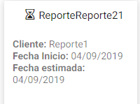

Proyecto Final Individual
=========================

Indice

[0.Agradecimientos](./agra.md)

[1.Introducción](./intro.md)

[2.Proyecto](./project.md)

[3.Herramientas](./tools.md)

[4.Herramientas secundarias](./tools2.md)

[5.Componente](./component.md)

[6.Problemas](./problems.md)

[7.Miscelanea](./misc.md)

[8.WebGrafía](./web.md)

0.Agradecimientos
==================

En primer lugar, agradecer al instituto CIP FP Batoy por darme la
oportunidad de realizar las prácticas (las que creo, serán las últimas)
y sobre todo haberme formado para poder realizar tanto estas, como
cualquier futuro trabajo que se pueda presentar en el mundo laboral.

En segundo lugar, también a la empresa Aitex la posibilidad de realizar
las prácticas en sus instalaciones y haberme formado en las tecnologías
y herramientas que aquí se utilizan para desarrollar este proyecto.

Agradecimientos también para mi tutor en la empresa Amando Olcina,
responsable del Área de Desarrollo, por su dedicación y su tiempo en
conseguir que entendiera y aprendiera todos y cada uno de los conceptos
aprendidos, así como su ayuda durante la realización del proyecto.

Finalmente agradecer también a Gonzalo Cambra, integrante del equipo del
Área de Desarrollo, la ayuda brindada durante la ejecución del proyecto,
así como su apoyo y su paciencia para explicarme las dudas y situaciones
que iban surgiéndome.

Han conseguido hacer de estas prácticas las mejores hasta la fecha y que
junto a todo el Equipo de Sistemas y Desarrollo, han logrado integrarme
como uno más del grupo.

1.Introducción
===============

Para empezar, me gustaría mencionar que este no era el primer proyecto
que yo tenía asignado de cara a la realización de las prácticas. La idea
que se pretendía llevar a cabo como primera opción consistía en realizar
uno de los proyectos proporcionados por el profesorado. Este trataba de
llevar adelante la creación de una aplicación que permitiera a los
usuarios de la sección de Hostelería del instituto efectuar una gestión
de los proveedores que proporcionan diferentes productos a su
departamento.

De la misma forma que ha cambiado el objetivo del proyecto, las
herramientas a utilizar en este también ya que iba a utilizarse Laravel
para su realización.

Debido a que en la empresa se me permitió trabajar con las tecnologías
empleadas en esta, decidí no llevar acabo lo mencionado anteriormente e
iniciar un proyecto diferente.

2.Proyecto
===========

2.0. Lugar de realización
-------------------------

La empresa seleccionada como ya he mencionado es Aitex.

2.0.0. Sobre la empresa
-----------------------

Se trata de una asociación de carácter privado sin ánimo de lucro,
conocida por ser un importante instituto tecnológico textil, cuyo
objetivo primordial es mejorar la competitividad del sector.

Se fomenta la modernización y el uso e introducción de nuevas
tecnologías a través de proyectos de I+D+I. Además, promueve el hecho de
que cualquier persona o empresa pueda asociarse a este instituto.

Posee representación en varios países y continentes, disponiendo de
sucursales en países como Atlanta, Bogotá, Onteniente, Puebla, Shanghái,
Sao Paulo... Entre otras.

### 2.0.1. Tecnología

Principalmente la manera de trabajar en la empresa es mediante licencias
Microsoft. La mayor parte si no casi la totalidad de los programas que
aquí se utilizan emplean dicha licencia, un ejemplo sería Office 365.
Esto por supuesto lleva a utilizar la nube para trabajar con los datos
que ellos utilizan.

El apartado enfocado a la estructura de red quedaría resumido en esta
imagen:

(Imagen 1: Estructura de red de la empresa por plantas)

2.1. Motivos del proyecto
-------------------------

Como bien he dicho, el poder realizar un proyecto con herramientas y
tecnologías con las cuales no había trabajado me pareció mejor idea que
tal vez realizar uno con conceptos ya vistos en clase. Sobre todo, por
el hecho de que aquí se están utilizando programas, lenguajes y
herramientas que realmente se emplean fuera, en el mercado laboral y que
es lo que las empresas reclaman o buscan.

Teniendo en cuenta estos aspectos, vi más ventajas en aprender cómo
funciona la manera de trabajar en la empresa, aunque al principio
tuviera que pasar un periodo de formación más largo. Pese a esto me
parece que tomé la mejor decisión ya que he aprendido muchos nuevos
conceptos.

2.2. Descripción del proyecto.
------------------------------

El proyecto que se me planteó a realizar en la empresa consistía en
realizar un componente al que poder efectuar una serie de pruebas o test
y así comprobar la calidad del código programado. Básicamente se trata
de un testeo de aplicación web con diferentes herramientas las cuales se
explican más adelante.

Al principio no conocía exactamente sobre qué archivos trabajaría y cuál
sería la finalidad del proyecto que iba a llevar a cabo, pero hoy en día
tras haberlo finalizado si puedo explicar en qué consiste y cuál es su
funcionamiento.

La idea principal es preparar un componente que se encargue de mostrar
con una vista distinta a la actual diferentes reportes que posee la
empresa, cada uno con sus datos y sus características. La vista que
actualmente poseen para visualizar dichos reportes se encuentra en forma
de tabla, con una cabecera que divide la tabla en los campos que se
mostrarán y las filas que poseen la información a mostrar de cada
reporte. Adjunto imagen a continuación:

(Imagen 2: Imagen para mostrar donde adaptar el componente)

Como podemos observar, además de los campos, encontramos una barra de
búsqueda que tiene también la finalidad de poder filtrar los reportes
según nuestros intereses. Observamos como campos de la tabla además un
icono que nos indica el estado del reporte, para saber si este se
encuentra finalizado o en proceso. Junto a este tenemos tres iconos más
los cuales permiten llevar a cabo distintas acciones las cuales se
explicarán más adelante. Esto sería lo más remarcable de la imagen
superior.

2.3. Objetivo general del proyecto.
-----------------------------------

Los principales objetivos que se aspiran a cumplir de cara a la
realización de este trabajo son los siguientes:

-   Aprender a trabajar con las tecnologías que se me han enseñado en la
    empresa durante el tiempo que he estado en ella. Comprender su
    funcionamiento y saber aplicarlas a casos reales de uso.

-   Preparar el diseño del componente, concretar como será y que
    funcionalidades tendrá.

-   Desarrollar el componente para que en un futuro próximo pueda tener
    un uso útil dentro de la empresa.

-   Testear dicho componente ya que se trata de una de las partes más
    importantes de mi periodo de prácticas aquí. Con esto se comprobará
    la calidad del código.

2.4. Finalidad y posibles usos.
-------------------------------

Como ya he mencionado, la idea es hacer un componente funcional. El
objetivo de este es simple ya que se encargará de proporcionar la
posibilidad de tener diferentes maneras de visualizar los reportes
dentro de la página que se quiera implementar. También se está teniendo
en cuenta la oportunidad de adaptarlo a otros apartados de la empresa,
para que no solo pueda utilizarse en la tabla en cuestión. Además, en
caso de visualizar los reportes desde un dispositivo móvil, creemos que
con esta vista se puede facilitar la navegación a través de la página.
Resulta mucho más visual e intuitiva manteniendo las funcionalidades
mostradas en el formato de tabla. Posible muestra de cómo debe quedar:

(Imagen 3: Ejemplo de posible resultado) La idea sería que el resultado
fuera algo similar a esto, con la diferencia de que se trata de un
trabajo más serio y no tendrá tanto color. Se encargará de poder llevar
a cabo simplemente las funcionalidades básicas.

2.5. Apartados a tratar
-----------------------

Ahora pasaré a explicar todas las tecnologías que se han empleado
durante la realización del proyecto pero encima, sin entrar mucho en
materia más que con una definición para cada una de ellas y tras esto
pasaré a dar una explicación más extensa de mi componente y la
implementación de estas tecnologías en mi proyecto, como han afectado,
problemas que me han surgido con ellos y para finalizar un apartado de
conclusiones, inquietudes, así como los problemas que he tenido en
general y una webgrafía con las páginas más importantes utilizadas.

3.Tecnologías utilizadas
=========================

3.0. JavaScript
---------------

Principalmente, al inicio del proyecto, todo el código estaba compuesto
por este lenguaje.

\"JavaScript es un lenguaje de programación que te permite realizar
actividades complejas en una página. Se trataría del tercero de los
estándares en las tecnologías para la web, dos de las cuales son (HTML y
CSS).

Permite crear contenido nuevo y dinámico, controlar archivos de
multimedia, crear imágenes animadas y muchas otras cosas más.\"

Simplemente he querido nombrarlo por encima ya que se trata de un
lenguaje que hemos estado viendo a lo largo del curso en el instituto.
De todas formas, no está de más mencionarlo ya que ha sido desde el
principio la base de todo el componente pese a que al final el lenguaje
pasase a ser otro. Bajo muestro una imagen del código base programado
con JS, a partir del cual nace mi componente:

(Imagen 4: Trozo de código JS del componente)

3.1. TypeScript
---------------

\"TypeScript es un lenguaje de programación de código abierto
desarrollado por Microsoft, el cual cuenta con herramientas de
programación orientada a objetos.

Este convierte su código en JavaScript común. Es llamado también
Superset de JavaScript, lo que significa que, si el navegador está
basado en JavaScript, este nunca llegará a saber que el código original
fue realizado con TypeScript y ejecutará el JavaScript como lenguaje
original.

Decimos que una tecnología es un superset de un lenguaje de
programación, cuando puede ejecutar programas de la tecnología,
Typescript en este caso, y del lenguaje del que es el superset,
JavaScript en este mismo ejemplo. En resumen, esto significa que los
programas de JavaScript son programas válidos de TypeScript, a pesar de
que TypeScript sea otro lenguaje de programación.\"

De todas formas, apenas me costó de aprender su funcionamiento ya que el
uso que le di fue para tipar los datos, las funciones... Entendiendo por
tipar, el hecho de decirle a una variable que tipo de valores va a
manejar, que tipo de valores devolverá una función, etc.:

3.2. React
----------

\"Es una librería JavaScript de código abierto para crear interfaces de
usuario con el objetivo de animar al desarrollo de aplicaciones de una
sola página. Ayuda a los desarrolladores a construir aplicaciones que
usan datos que cambian constantemente.

El objetivo principal de esta librería es ayudar a los desarrolladores
en la creación de aplicaciones web de una manera más ordenada y con
menos código del que escribiríamos si creásemos nuestra aplicación con
JS puro u otras librerías como podría ser JQuery.\"

Como mencioné anteriormente, en un principio el lenguaje principal de mi
proyecto era JS, pero al cambiar a TS también incluí la librería de
React ya que es una de las principales herramientas con las que se
trabaja en la empresa. Tal vez, junto con los tests los cuales se
explicarán más adelante, este ha sido uno de los conceptos que más me
costó entender al principio en las explicaciones. Al ir trabajando con
la librería he ido comprendiendo cómo funcionaba esta y me he adaptado a
su manera de trabajar.

Actualmente, durante la realización de mi proyecto en mayo de 2019,
estoy trabajando con la versión 16.8.0.

3.3. Redux
----------

Esta es una librería que no he acabado de acoplar al proyecto debido a
la falta de tiempo pero que como he visto y trabajado unas semanas con
ella mencionaré de todas maneras.

Para ponernos en situación, antes de intentar implementar redux en el
componente, casi desde el principio, los datos que muestran las tarjetas
estaban siendo tomados desde un fichero que tengo dentro de la
estructura del proyecto.

Se trata de un fichero JS con todos los valores a mostrar:

(Imagen 5: Muestra de los datos que se están tomando para mostrar).

En la imagen superior tenemos un par de ejemplos de los datos. Estos son
los que utiliza actualmente la aplicación para trabajar.

Por ahora si quisiera trabajar con datos nuevos tengo dos opciones. O
meto un nuevo fichero con los mismos campos que se mostrarán en tarjetas
y así cambian los valores a mostrar. O la segunda opción es ir
introduciendo nuevas entradas al final del actual fichero y este
automáticamente creará tarjetas según los datos recibidos.

Esto estaría muy bien de no ser porque, al fin y al cabo, se espera que
el componente tenga unos datos que puedan cambiar continuamente ya que
aquí se trabaja con una gran cantidad de valores y no se podrían estar
metiendo a mano.

Llegados a este punto y para solucionar el problema, tendríamos redux.
Esta herramienta o librería tiene una ventaja que permite que podamos
trabajar con datos que vayan cambiando gracias a una propiedad conocida
como estado. Digamos que este estado se encarga normalmente de almacenar
datos que recibe a través de un API REST o webService (en mi caso, el
listado de los reportes). Así que la finalidad de este es que cambiase
la forma de tomar los datos.

3.4. Jest
---------

"Se trata de un framework que podría definirse como una plataforma de
prueba universal, con capacidad para adaptarse a cualquier biblioteca o
marco de JS. Es una herramienta con la que poder dar potencia y
flexibilidad a nuestras pruebas, con una gran velocidad a la hora de
usarlo, así como el hecho de permitir diferentes tipos de tests."

Durante la realización de este proyecto se está trabajando con la
versión 23.6.0.

3.5. Enzyme
-----------

Podríamos explicar esta herramienta junto con la anterior debido a que
se trata de una utilidad de test para pruebas con react, esta nos
facilita mucho el hecho de realizar dichas pruebas a la hora de pasar el
test, encontrar los errores de nuestro código... Digamos que su
principal función es que jest pueda entender react ya que,en un
principio, este está preparado para trabajar con JS y TS. Si incluimos
enzyme junto con Jest entonces si puede interpretar react.

Algo importante a remarcar es que enzyme trabaja con distintas versiones
de react, por lo cual, necesita saber que versión vamos a usar, para
esto, existe un fichero de configuración que se encarga de controlar
esto.

(Imagen 6: Fichero con la configuración de adapter).

Estoy trabajando con la versión 3.9.0.

3.6. NodeJS
-----------

La manera más sencilla de definir nodeJS sería: "Es un entorno
JavaScript de lado de servidor que utiliza un modelo asíncrono y
dirigido por eventos. Su principal función es la de ser útil en la
creación de programas de red escalables, el mejor ejemplo sería un
servidor web". Se ha hecho popular debido a su versatilidad. Dispone de
utilidades que nos permiten trabajar y automatizar tareas para llevar a
cabo el desarrollo de aplicaciones orientadas a redes de comunicación.

Estoy trabajando con la versión 10.15.3.

3.7. i18n
---------

A la hora de crear una aplicación que pueda estar enfocada a personas de
diferentes nacionalidades, uno de los principales problemas que
encontraremos será el hecho de afrontar que no todas van a comunicarse
en el mismo idioma. En este caso, al programar dicha aplicación o página
web nos encontraremos con la necesidad de proporcionar la
internalización para nuestros usuarios de los textos, mensajes,
avisos... que aparezcan en ella.

Para llevar a cabo dicha tarea, actualmente contamos con una herramienta
conocida por el nombre de i18n. Se trata de una librería de javascript
que tiene la finalidad de facilitarnos ese proceso de internalización.

Para que un componente pueda utilizar la internalización deber de estar
envuelto por él, esto lo conseguimos gracias a esta sentencia.

(Imagen 7: Envolviendo componente de cardRender).

3.8. Moment JS
--------------

Se trata de una librería de JS que tiene como finalidad ayudarnos a
solventar los problemas que puedan surgir con las fechas que utilicemos
en nuestra web. Gracias a esta librería, tenemos una gran cantidad de
opciones a realizar entre fechas:

-   Formatear fechas para adaptarlas a diferentes localizaciones por
    idioma o cultura.

-   Trabajar con horas, mostrar estas en diferentes formatos.

-   Trabajar con fechas, visualizar estas en diferentes formatos.

-   Preparar contadores de tiempo y controlar el tiempo que ha pasado
    entre dos fechas.

Entre otras opciones.

3.9. Webpack
------------

Podríamos definir Webpack como un empaquetador de módulos, este permite
la generación de un archivo único que posea todos los módulos que
nuestra aplicación necesita para funcionar. Para que quede algo más
claro, este permite meter todos los archivos JS que tengamos en un mismo
archivo. La manera más básica y sencilla para entender cómo funciona
sería el compararlo con un ejecutable .EXE el cual encontraríamos a la
hora de instalar un programa, al ejecutarlo, este realiza las tareas
necesarias por sí mismo para llevar a cabo la instalación del programa.

Además de encargarse de empaquetar módulos, este puede llevar a cabo
muchas más acciones:

-   Gestionar dependencias.

-   Ejecutar tareas.

-   Conversión de formatos.

-   ...

De todas formas, también posee bastantes inconvenientes ya que se trata
de un programa que puede resultar complejo tanto por su código fuente,
como por la documentación, la cuál es bastante pobre.

3.10. esLint
------------

"Los linters son una herramienta. Estas tienen como función base,
analizar nuestro código, y a partir de una serie de reglas definidas por
nosotros (o podemos extenderlas de otras ya predefinidas) nos va a
mostrar los errores que estamos cometiendo en nuestro código.".

Según lo que estoy entendiendo yo por la definición superior, se
trataría de una herramienta que nos ayudará a encontrar los posibles
errores de escritura que podamos producir en nuestro código mientras
programamos. Permite controlar el estilo, mostrarnos bugs... En general,
controlar lo que escribimos y ayudarnos a mejorar el código.

En este caso, esLint sería un linter. Existen una gran cantidad de ellos
y cada uno puede ir enfocado a un lenguaje en concreto, por ejemplo,
tsLint para TypeScript, StyleLint para estilos o esLint para JavaScript
que es el que yo estoy usando.

Para un lenguaje como es JS el cuál podríamos definir como "dinámico" y
que permite una gran cantidad de maneras de escribir el código, esLint
puede ayudarnos mucho para problemas que puedan pasarse por alto, así
como llegar a avisarnos de fallos sin necesidad de ejecutar el código
para así poder solucionar estos de forma manual. En ocasiones, el propio
programa podrá encargarse de solucionar el error automáticamente.

La ventaja es que se nos permite crear nuestras propias reglas, así como
utilizar las que ya vienen definidas. Esto permite llevar a cabo lo
mencionado anteriormente.

Para que la corrección sea mucho más cómoda, cuenta con un comando que
permite lanzar una vista, la cual nos notifica exactamente qué nos
aconseja cambiar el programa según las normas que tiene este
configuradas. Nos indicará la línea y cuál es el error que debemos
solucionar. Más abajo explicaré como acceder a dicha vista.

(Imagen 8: Logo ESLint).

4.Otras herramientas / tecnologías
===================================

4.0. NPM
--------

A lo largo de la realización del proyecto, ha sido necesaria la
instalación de los paquetes mencionados en el punto anterior, para ello
he utilizado un gestor de paquetes.

Existen bastantes más gestores de paquetes, pero en este caso nos
centraremos en el más importante hasta la fecha el cual lleva el nombre
de NPM. Se trata de un gestor enfocado tanto al frontEnd como al backEnd
y es una de las razones por las cuales es sino el más popular, de los
más populares, ya que muchos no se centran en ambas partes.

La finalidad de utilizar NPM es hacer que trabajar con nodeJS
(mencionado más arriba) sea mucho más sencillo. Esto es debido a que nos
permite instalar librerías enteras con una sola línea de código. Ayuda a
administrar módulos, distribuir paquetes, agregar dependencias...

A continuación, pondré un par de ejemplos para instalar alguno de los
paquetes superiores:

(Imagen 9: Línea de comando para instalar el paquete de React).

(Imagen 10: Línea de comando para instalar el paquete de Redux).

Como podemos observar, es muy sencillo de usar npm para realizar
acciones de instalación, más adelante explicaré otros usos posibles.

4.1. MarkDown
-------------

A la hora de realizar la documentación de este proyecto, comencé
utilizando un simple editor de textos como bien puede ser el Word, el
cual al finalizar tenía pensado pasar a PDF una vez estuviera finalizada
dicha documentación.

Finalmente, en la empresa se me aconsejó utilizar la herramienta
conocida por el nombre de MarkDown. Se trata de un lenguaje de marcado
ligero y su finalidad es facilitar la publicación de contenido ya que
permite que el resultado sea mucho mejor redactando de una manera mucho
más rápida. La idea es que una vez el proyecto está terminado, realizar
la documentación en GitHub utilizando MarkDown para su edición.

(Imagen 11: Sintaxis de MarkDown).

A continuación, se muestra una imagen con el editor de textos que posee
MarkDown para Visual Studio Code, seguida de otra que mostrará el
visualizador de contenido, es un apartado muy útil ya que puedes
observar cómo va siendo el resultado del documento que estás redactando:

Podemos observar que las dos imágenes pertenecen a la misma parte de
código y cuál es el resultado.

(Imagen 12: Editor de MarkDown).

(Imagen 13: Visualizador de MarkDown).

4.2. Office 365
---------------

Una de las herramientas que tiene la empresa y que, junto con la
siguiente, serían de lo que más he utilizado es Office 365. Además, al
principio de mi estancia aquí recibí un curso para aprender su uso.

Se trata de un programa o herramienta la cual distribuye Microsoft de
pago, enfocada principalmente tanto para uso personal y sobre todo a
empresas. Su tuviera que explicarlo según lo que yo he podido probar de
ella, sería como tener una gran cantidad de aplicaciones a simplemente
un click. Esto se debe a que disponemos desde aplicaciones básicas para
cualquier empresa como bien podría ser Word, Excel, el servicio de
mensajería de Outlook...

(Imagen 14: Herramientas que permite usar Office 365).

Hasta herramientas menos conocidas como Teams (sería algo similar a un
Skype para empresas donde poder comunicarse con más facilidad que por
correo), Yammer (similar a un Facebook) o Stream (la que más he
utilizado yo durante mi periodo de prácticas y sobre todo durante el
primer mes de formación aquí).

Esta última sencillamente es una plataforma desde la que poder compartir
todo tipo de videos que suban los empleados, pero enfocada a trabajo, ya
sea para compartir tutoriales, conferencias grabadas...

Y digo que esta es la que más he usado ya que los tutoriales de
formación que se me facilitaron desde el principio por el departamento
de informática se encontraban aquí.

(Imagen 15: Plataforma de videos)

4.3. Visual Studio Code (VSC)
-----------------------------

Junto con Office 365, Visual Studio Code sería la herramienta más
importante que he utilizado durante las prácticas ya que al fin y al
cabo es el programa con el que he escrito todo el código de mi
componente.

Al fin y al cabo, no deja de ser un programa para poder escribir líneas
de código como podría haber sido cualquier otro, por lo que no hay mucho
que explicar. Una de las ventajas que sí que he visto a la hora de
utilizarlo es el hecho de tener un apartado desde el que instalar
diferentes plugins de una manera muy sencilla.

Algunos de los que he instalado serían los siguientes:

-   FileIcons: resulta de bastante utilidad ya que según el tipo de
    archivo tendrá un icono u otro. Esto ayuda a la hora de visualizar
    los archivos en la estructura de directorios de VSC.

-   ESlint: explicado arriba. (Ayuda a la hora de programar).

-   MarkDown: explicado arriba. (Utilizado para la documentación del
    proyecto).

Además de los plugins, un apartado que debería mencionar sería también
el de la consola que posee ya que a la hora de lanzar el componente para
ver si funciona o los tests también ha sido de mucha ayuda. Por ejemplo,
MarkDown también utiliza comandos del terminal para exportar la
documentación que crees en diferentes formatos.

(Imagen 16: Interfaz VSC).

4.4. Documentación de LemonCode
-------------------------------

Para acabar con el apartado de recursos que he utilizado o se me han
ofrecido, creo que no estaría de más mencionar los cursos de LemonCode,
ya que aproximadamente durante mis primeras 60-70 horas aquí en la
empresa estuve aprendiendo a trabajar con todas y cada una de las
diferentes librerías, herramientas, programas...

Todo esto ha sido posible gracias a dichos cursos, los cuales se me han
sido proporcionados en formato de video principalmente. Además de poder
ver cada curso, he contado también con el apoyo de la explicación y
documentación en formato de texto e imágenes, que los mismos creadores
de LemonCode tienen para la disposición de todo el mundo en su GitHub y
a los cuales se puede acceder de manera completamente gratuita. \[GitHub
de LemonCode\]

(Imagen 17: GitHub de LemonCode).

5.Mi componente
================

Una vez acabada la parte de recursos utilizados vamos a pasar a como ha
sido el proceso de creación de mi componente y en general cuál es su
funcionamiento.

5.1. Preparación y montaje.
---------------------------

El primer paso fue hablar con el tutor encargado en la empresa, sobre
cuál iba a ser el proyecto que llevaría a cabo durante el período que
estuviese aquí de prácticas.

Como bien se ha mencionado al principio, el problema que se debía cubrir
era la necesidad de disponer de una vista para los reportes de la
empresa diferente a lo que se tenía actualmente.

Por ahora, hasta que pueda implementarse mi componente, no es cómodo
moverse a través de una tabla con una gran cantidad de filas ya que
visualmente no es sencillo buscar lo que necesitas. Al final con dicho
componente la vista que podría implantarse sería muchísimo más visual e
incluso serviría para dispositivos móviles.

Una vez aclarado el objetivo del proyecto, se me facilitó un código
sacado de internet que me serviría como plantilla. La página de la que
tomé el código es la siguiente:

\[Página del componente\]

Primero que nada, tuve que hacerme a las tecnologías y al código (ya que
no era algo que hubiera programado yo) y por lo tanto no entendía cuál
era su funcionamiento, así que tras preparar el entorno para trabajar
con el código y que se visualizase en el navegador el componente comencé
con los cambios para adaptarlo a las necesidades que yo tenía.

Muchas de las funciones que ejecutaba no me hacían falta así que tuve
que eliminarlas o prepararlas para el que sería el código final.

Aunque al principio iba algo perdido, esto me sirvió para saber
exactamente cómo funcionaba el programa y a partir de ahí empezar a
programar.

(Imagen 18: Ejemplo de una parte del código básico y el resultado al
ejecutarlo).

Dicho componente se encontraba íntegramente programado en JS lo cual fue
una enorme ventaja a la hora de comprenderlo.

Tras quitar las partes que no me interesaban y adaptar un poco las
líneas, el resultado era algo similar a esto en su primera versión:

(Imagen 19: Primera versión del componente).

De primeras, el fallo que se debía de arreglar aquí era el hecho de que,
al expandir el reporte para ver las muestras, este descuadraba toda la
fila y acababan todas desordenadas.

Más adelante la solución fue alternar entre dos vistas para cada
tarjeta, una con los datos de los reportes y otra con las muestras,
junto con un scroll para cada tarjeta que solo aparecía si eran
demasiados los datos que se tenían mostrar. Con esto nos evitamos el
hecho de que una tarjeta sea más grande que otra. Todas tienen el mismo
tamaño y varia lo que tienen dentro.

Como podemos observar en la foto superior, para cargar más reportes
también encontramos un botón en la parte inferior, el cual nos permite
llevar a cabo la acción de carga. Al principio estaba bien para saber
cómo iba la toma de datos y para ir entendiendo conceptos, pero para que
realmente el componente sea funcional, la idea es que los datos se
fueran cargando automáticamente a medida que descendiésemos por la
página. Para esto, encontramos un componente ya creado en React llamado
infiniteScroll el cual permitía que simplemente usando la rueda del
ratón se cargasen los reportes y además mostrase un mensaje cuando
hubiese acabado de cargarlos.

Una vez preparado el código con el que empezar a trabajar le tocó el
turno a TS que como bien he explicado en su apartado, lo que
conseguíamos utilizándolo era tener tipadas variables y funciones.

(Imagen 20: Ejemplo de uso de TS)

En la imagen superior podemos observar un trozo del código del
componente en el que se ve claramente el uso de TypeScript:

-   Estamos tipando la variable title para dejar claro que trabajará con
    cadenas de texto, si intentase tomar un valor numérico (siempre que
    no esté puesto en forma de cadena de texto), un booleano o un valor
    diferente al de una cadena, nos avisará de que existe un error.

-   De la misma forma, la función getTitle devolverá valores del tipo
    string.

El hecho de utilizar TS nos puede ayudar a tener controladas las
variables de nuestro código y así evitarnos dolores de cabeza ya que
sabremos en todo momento que tipo de valores están manejando.

5.2. React
----------

La mayor parte de los problemas llegados a este punto consistían en
saber cómo funcionaba React, la toma de datos, la modificación del
estado de la aplicación para leer esos datos... Por el hecho de que era
programar de una manera nueva para mí y en poco tiempo estaba
aprendiendo muchos conceptos.

Se trata de una librería basada en un sistema de jerarquía formado por
funciones (las cuales se utilizan para comunicarse con los elementos o
niveles superiores) y por propiedades (gracias a las cuales se produce
la comunicación con los elementos o niveles inferiores).

Ésta posee lo que se conoce como ciclo de vida, el cual podría dividirse
en tres grupos que poseen una serie de métodos específicos. Me limitaré
a mencionar los 3 más importantes y luego los métodos que yo he
utilizado. Al crear e interactuar con un componente este pasa por tres
ciclos:

-   Montaje (mounting)

-   Actualización (updating)

-   Desmontaje (unmounting)

En la imagen inferior podemos apreciar una parte del ciclo de vida de
React en ECMAScript 6.

(Imagen 21: Ejemplo de uso de React en mi componente)

-   render: se encarga de renderizar el HTML del componente en el
    navegador.

-   componentDidMount: solo se ejecuta una vez el componente ha sido
    cargado en el DOM.

De la misma forma que el componente está programado en React, éste se
encuentra dentro de otro tomado de internet, el cual también se creó a
partir de React y que tiene la función de mostrar un Scroll cuando la
página cree que es conveniente añadirlo para poder navegar por ella más
cómodamente, llamado InfiniteScroll. Dentro de este segundo componente
es dónde está alojado el componente creado por mí.

(Imagen 22: Código en React del componente de scroll infinito)

Otro aspecto muy importante para mencionar que he tenido que utilizar
con React en mi proyecto ha sido el de emplear lo que se conoce como
estado.

Este "estado" se encargaba de almacena los datos dentro del componente
de manera local, es decir, controlaba los datos que provenían desde mi
fichero JSON y permitía que el resto del componente los utilizase. Al
mismo tiempo, el componente controla el estado.

Digamos que empieza con unos valores por defecto pero que, a lo largo
del ciclo de vida del componente, los datos pueden mutar. Una vez
arreglados los problemas y acabado la parte de la carga de datos, tuve
que hacer algún cambio en la interfaz del componente para adaptarla a
los nuevos datos que contenía el fichero.

(Imagen 23: Cambios en la interfaz y componente, cerca de la versión
final).

En la imagen superior podemos ver como realmente los cambios empiezan a
ser notables ya que ahora cuando se despliegan las muestras estas no
descuadran el resto de los reportes si no que se adaptan a la tarjeta.

La carga de datos sigue siendo por scroll. Este aparece de manera
automática cuando el componente detecta que la página necesita más
espacio, mientras eso no ocurra, los primeros reportes se cargarán de 8
en 8 con la ayuda de un botón.

El estado del reporte ahora se muestra junto al nombre y los datos
mostrados en el reporte solo son los 3 que observamos. Además, según el
estado que tenga la tarea, el icono de descarga aparece o no.

5.3. esLint
-----------

Como bien había mencionado más arriba en su apartado dedicado, esLint
nos ayuda a mejorar el código que escribimos, para ellos tenemos una
vista que nos ayuda a ello.

Para lanzar esta vista tenemos que introducir en el terminal un comando:

(Imagen 24: Lanzar esLint).

Esto se encarga de crear un archivo HTML que nos permite posteriormente
ejecutarlo, para poder cargar la vista con los errores. El comando lo
que está haciendo primeramente es eliminar dicho archivo para
posteriormente, analizar todos los archivos que se encuentren en la ruta
especificada con los formatos marcados y genere un nuevo archivo de
errores. El resultado sería algo así.

(Imagen 25: Vista esLint de errores)

Como podemos observar, se nos indica que tipo de error se está
produciendo, la línea y la columna del error o el aviso e incluso nos
deja una URL que nos explica cómo podemos solucionar el problema que
podamos tener.

5.4. Internalización y moment
-----------------------------

En mi caso, el componente en si no posee una gran cantidad de texto que
podríamos internacionalizar, pero aun así hay palabras que necesitaba
traducir.

En cada tarjeta contamos con unos datos los cuales nos muestras valores
como el cliente del reporte y las fechas de inicio y de fin. Tanto como
las palabras que preceden a los datos como los propios datos deben ir
internalizados. El formato de fecha que aquí usamos es diferente al que
se usa en otro país por poner un ejemplo.

Dentro de cada tarjeta, al pasar el ratón por cada elemento, también
tenemos una internalización de los mensajes para saber exactamente la
función de cada cabecera o incluso de cada icono.

(Imagen 26: Ejemplo internalización)

Se trata de la internalización del componente y del uso de moment. Como
bien he explicado en sus respectivos apartados:

-   La internalización para páginas las cuales van a ser vistas por
    diferentes culturas o desde diferentes países es realmente
    importante ya que va a ayudar a los usuarios a comprender su
    funcionamiento y les permite saber para qué sirve cada apartado sin
    necesidad de traducir ninguna parte del texto.

-   De la misma forma, con moment tenemos a nuestra disposición una gran
    cantidad de maneras de trabajar con las fechas.

De la traducción es de lo que se encarga la internalización del
componente, así que, abriendo la página desde otro país, cambiarían las
palabras a el idioma en concreto (Por ahora implementados el español y
el inglés). A continuación, tenemos el ejemplo en código de como
quedaría la fecha formateada en el código y cuál es el resultado que
obtenemos en la web:

(Imagen 27: Visualización del formato dado a la fecha en el código y la
manera de escribirlo.)

En la siguiente imagen vemos que formato toma la fecha según el estilo
que hemos programado en el código:

(Imagen 28: Muestra del resultado del formateo de la fecha).

(Imagen 29: Fecha sin moment). Después de editarla tendríamos un
resultado como este:

(Imagen 30: Fecha con moment).

Para que la internalización pueda llevarse a cabo, es necesario un
archivo de configuración el cual contiene los idiomas que van a
utilizarse, el archivo en cuestión es el de i18n.ts:

(Imagen 31: Parte del archivo de configuración de la internalización 1)

En este caso, estamos importando los lenguajes con los que se trabajaran
y más abajo se encuentran las funciones para que todo se ejecute. No me
parece necesario explicar más de esto ya que al fin y al cabo dicha
configuración puede encontrarse en internet.

(Imagen 32: Parte del archivo de configuración de la
internacionalización 2)

En la imagen inferior vemos un trozo de código que corresponde con el
uso de la internacionalización en mí componente. Cuando queremos
implementarla en un documento, lo que tenemos que hacer es importar el
archivo de configuración mencionado antes. Este accede a los archivos de
traducción con todas las definiciones y cuando queramos introducir una
definición en concreto lo haremos de la siguiente manera:

(Imagen 33: Ejemplo de uso de Internacionalización)

-   Aquí tenemos un fragmento del archivo de traducción, en la imagen
    superior queríamos sacar la traducción del estado del reporte:

(Imagen 34: Fichero traducciones).

-   La ruta a seguir para acceder a esa traducción sería la siguiente:

(Imagen 35: Formato para sacar los valores de los ficheros de
traducción).

Para acceder a las traducciones, como vemos en las imágenes superiores,
es algo así como seguir una estructura de pirámide o por niveles,
tenemos que ir entrando en el apartado que nos interesa e ir poniendo la
ruta para sacar finalmente la traducción.

5.5. Estructura de ficheros
---------------------------

Una vez terminada la mayor parte de la programación creo que no está de
más mencionar como ha quedado la estructura del proyecto.

-   En general, la estructura que posee mi proyecto no tiene nada fuera
    de lo normal.

Podemos observar como las primeras carpetas simplemente se encargan de
almacenar archivos de configuración, scripts para que funcione el
programa o diferentes apartados de mi proyecto... La única diferente
sería la de IMG la cuál almacena las imágenes que utilizo en la
documentación de MD. - Entrando ya en materia, la carpeta más importante
que utilizo sería la de SRC, en la cual se encuentra almacenado el
código que yo mismo he escrito.

-   Dentro de ésta, vemos una llamada Assets, la cual tiene dentro una
    carpeta llamada locales. Posee los archivos con la información de
    los idiomas a los que se puede traducir el componente, en este caso,
    a español e inglés.

-   Pasando a la carpeta de components, en ella encontraremos la parte
    de código programada por mí. Los archivos terminados en
    spech.tsx.snap de la carpeta SnapShots corresponden a los tests de
    interfaz realizados, así como los terminados en spech.tsx
    corresponden a tests de funcionalidad.

(Imagen 36: Estructura del proyecto).

Los dos archivos de la carpeta components llamados tile.tsx y
cardRender.tsx corresponden a el código principal de mi componente.

En el archivo tile, estoy creando la estructura principal del
componente, lo que sería el contenedor que más tarde alojará los
reportes o tarjetas.

El archivo de CardRender contiene la estructura de las tarjetas. En el
indico que campos contendrá, como irán ubicados, que iconos saldrán,
etc.

De ir añadiendo más funcionalidades al proyecto, los archivos donde
programase dicha funcionalidad y los tests que realizase, se irían
almacenando en esta carpeta.

-   Continuando con la estructura de las carpetas, en la de CSS
    encontraríamos los estilos que se están utilizando en el lugar donde
    irá adaptado mi componente, con esto comprobamos como podrá ser el
    resultado una vez implementado en el lugar que le corresponde.

-   El apartado de iconos también tiene su espacio reservado, la carpeta
    de fonts posee los estilos de los iconos utilizados. Empecé usando
    FontAwesome pero en la empresa la herramienta utilizada para
    trabajar con ellos es IcoMoon. Una de las ventajas que tiene sobre
    otras posibles opciones es el hecho de poder descargar una librería
    de iconos personalizada, es decir, descargarías solo los que te
    interesasen, pudiendo añadir o eliminar según se necesite. Además,
    puede trabajar con FontAwesome.

-   El fichero data-source contiene la información de las tarjetas, los
    campos que estas albergan, así como los valores de las tarjetas.
    Ésta es la que se muestra dentro de cada una de ellas.

-   Podemos ver que encontramos otro fichero de tests, pero en este caso
    para el archivo de configuración de la internalización. Este archivo
    se encuentra justo bajo. Las funciones que realiza este documento
    han sido explicadas arriba.

-   Los demás archivos importantes que mencionaría serían el de
    style.css que va junto a los iconos y que marca los estilos de
    estos. El archivo de index.css corresponde al css de mi aplicación,
    posee el css creado por mí, así como trozos de código que venía con
    el componente y que pude emplear.

-   El archivo esLintValidation.html contiene la vista que podemos
    lanzar en el navegador y que nos mostraría los fallos cometidos
    durante la escritura de nuestro código.

-   Los archivos package contienen información sobre las versiones de
    los programas utilizados, configuración de éstos y en general
    configuración del proyecto (scripts para su funcionamiento, normas
    de ficheros, etc.).

-   Por último, encontramos el archivo readme.md donde se encuentra la
    información o documentación del proyecto.

Ésta sería la estructura que conforma mi proyecto en su versión final.

5.6. Funcionamiento del componente
----------------------------------

Llegados a este punto, el aspecto de las tarjetas y en general del
proyecto sería casi el definitivo. Primero explicaré que elementos
encontramos en ellas y también sus funcionalidades.

Pero antes, tenemos que aprender como lanzar el proyecto, para ello,
haremos uso de NPM:

(Imagen 37: Línea de comando lanzar el proyecto).

Se han dividido las tarjetas en 3 partes:

-Cabecera: primera parte que compone cada una de las tarjetas. Sería
similar a una cabecera y en esta podemos observar un icono que hace
referencia al estado del reporte, el cual puede ser finalizado y en
proceso. Además, junto a este icono, encontramos el que sería el numero
o nombre del reporte y que nos permite diferenciar a cada uno del resto.
Estos datos son estáticos en el sentido de que siempre se mostrarán esos
dos campos.

(Imagen 38: Cabecera de las tarjetas).

-   Contenido: Constituye la parte central las tarjetas. Al principio,
    cuando se carga la vista de los reportes por primera vez, podemos
    observar 3 campos que corresponden al nombre del cliente, a la fecha
    de inicio y a la fecha de finalización. Estos campos varían eso si,
    según el estado del reporte:

• Estado en proceso: Los datos mostrados son el cliente, la fecha de
inicio y la fecha de finalización o fecha estimada.

(Imagen 39: Reporte con estado en proceso).

• Estado finalizado: Los datos mostrados son el cliente, la fecha de
finalización y la fecha de caducidad.

(Imagen 40: Reporte con estado finalizado).

Junto con esta primera vista, tenemos otra que se encuentra oculta hasta
que no le damos al icono de mostrar reportes. Al darle al icono
correspondiente, la primera vista que teníamos cargada pasa a estar
oculta y en la tarjeta podremos observar los datos de las muestras. A la
vista de las muestras se le ha incluido la opción de un scroll
automático que aparece en caso de ser necesario visualizar una gran
cantidad de datos. Esto evita que las tarjetas aumenten su tamaño y, por
lo tanto, descuadren al resto de elementos del componente.

(Imagen 41: Vista de las muestras).

Una vez acabamos de ver la lista de muestras de los reportes, podemos
volver a la vista anterior pulsando sobre el icono de la X, situado en
la parte superior derecha. En el primer reporte no se ve el icono por el
tamaño, no deja mostrarlo.

-Barra de acciones: se trata de la última parte de los reportes, al
encontramos en la parte inferior. Esta parte se encarga de almacenar los
botones o iconos de acciones de las tarjetas. Depende de una serie de
factores, las tarjetas mostrarán en su parte inferior hasta un máximo de
3 iconos.

(Imagen 42: Barra de acciones en el pie de las tarjetas).

-   El primero de ellos corresponde la imagen de un clip. Su
    funcionalidad no está implementada pero el cometido de este icono es
    que se pueda visualizar el reporte sobre el que pulsemos de una
    manera más concreta. La idea sería pasar de una vista donde podemos
    ver cada tarjeta a una en la que nos centrásemos en el reporte en
    cuestión por si quisiéramos ver más en detalle ese elemento. Este
    icono no siempre está disponible o visible, ya que para que pueda
    verse, el reporte deberá tener un certificado. Si posee certificado
    aparecerá el icono, en caso contrario, estará oculto. Con
    certificado y sin certificado:

(Imagen 43: Tarjeta con certificado junto a tarjeta sin certificado).

-   El segundo icono corresponde a un icono de una hoja de papel. Éste
    se encarga de que, al pulsar sobre él, podamos visualizar las
    muestras de dicho reporte. El icono no tiene mucho más para explicar
    porque lo único que hace es mostrar las muestras del reporte. A
    diferencia del icono del clip, éste siempre está presente haya
    muestras o no, salvo cuando se ha abierto la vista de las muestras,
    aunque quizás una posible funcionalidad de las tarjetas podría ser
    que, en caso de no tener muestras, que ese icono no se mostrase.

(Imagen 44: Vista de los datos y de las muestras, se ve como no aparece
el icono de muestras).

-   Para acabar con los iconos de los reportes, tenemos el que
    corresponde al icono de descarga. Éste, por el momento, tampoco
    tiene implementada la funcionalidad al igual que el icono del clip.
    Principalmente la idea a llevar acabo es que, cuando pulsemos sobre
    él en un reporte, descargue dicho reporte en algún formato en
    concreto para poder visualizarlo en otro dispositivo o compartirlo.
    Una idea sería descargar la tarjeta en forma de tabla en un
    documento de texto como podría ser PDF o incluso en un EXCEL para
    trabajarlo. Para que este icono se muestre, el estado de la tarjeta
    ha de ser el de finalizado, ya que no tendría sentido intentar
    visualizar un reporte el cual no se haya terminado.

(Imagen 45: Tarjeta sin finalizar y tarjeta finalizada).

En cuanto a las partes que componen las tarjetas no habría nada más que
mencionar.

La primera vez que cargamos la página se pueden observar 8 tarjetas,
aunque este número puede ser variable y podríamos incluso mostrarlas
todas desde un primer momento o sólo mostrar una. Cuando queremos cargar
más tarjetas, en un primer instante disponemos de un botón que nos
permite llevar a cabo la acción. Éste cargará nuevamente otros 8
reportes. Llegados a este punto, debido al tamaño de las tarjetas, será
necesario ampliar el tamaño de la página para poder visualizar todos los
reportes. Para que esto sea posible aparecerá un scroll en la página.
Con la ayuda de este componente podremos desplazarnos por la ventana
para ver cada elemento.

(Imagen 46: Muestra del resultado final del componente)

A medida que descendemos por la ventana comprobaremos que la barra de
scroll aumenta. Esto se debe a que una vez cargados los reportes, hasta
que no quepan en la primera pantalla y aparezca el scroll, ya no nos
será necesario buscar el botón de cargar reportes. El componente se
encargará de ir cargando automáticamente todas y cada una de las
tarjetas hasta que haya mostrado todos los elementos. Se nos avisará de
esto con un mensaje en la parte inferior de la ventana al final de toda
la lista de tarjetas.

(Imagen 47: muestra del resultado final del componente).

5.7. Tests
----------

Tras acabar de configurar la internalización y el uso de moment,
prácticamente el componente está acabado. La única parte que necesita
todavía de algún cambio es la interfaz y el CSS para acabar de adaptar
realmente el componente a lo que se me exige.

El objetivo de realizar este proyecto era el de poder llevar a cabo un
testeo de aplicación. Para que eso pudiera ocurrir, antes que nada,
debía crearse el componente y, una vez tuviéramos un programa sobre el
que ejecutar los tests, llevar a cabo dichas pruebas.

El aparatado enfocado a los tests sería uno de los más importantes junto
con la creación del componente. Podemos encontrar dos tipos de pruebas a
realizar en mi código.

Los tests de interfaz o snapshots sólo analizan la interfaz o digamos la
parte visual, lo que se va a ver en la web. El segundo tipo de tests
analiza código, no tienes un resultado visual más que el de una tabla
que te notifica qué porcentaje de código queda cubierto.

En los tests de renderizado el funcionamiento es sencillo. Simplemente
se almacena en un documento una vista con la interfaz a la que le hemos
realizado la prueba. Una vez tiene guardado el "patrón" o el archivo
sobre el que se va a apoyar, si cambiásemos cualquier parámetro de la
vista, el test resultaría fallido porque se encarga de comparar el
contenido del archivo generado con el patrón o la vista que se acaba de
capturar.

(Imagen 48: Imagen donde se puede ser la estructura en "HTML" que se
mostrará en el test)

Por ejemplo, en la imagen superior estamos viendo el código del
componente. Se puede apreciar que la estructura que muestra la imagen es
lo que cargará el navegador y que verá el usuario. A la hora de
testearlo, el snapshot creará una vista con datos, con lo que se debería
mostrar en el navegador. Lo que nosotros observaremos en este test es
algo similar a abrir la consola del navegador:

(Imagen 49: Resultado del test de interfaz, estructura del componente)

Aunque este estilo de prueba sólo lo haya visto por encima para conocer
cuál era su funcionamiento, a continuación, dejo una imagen con la
definición de código que permite realizar un test de este tipo:

(Imagen 50: Muestra del código para que el test visto antes se ejecute).

Pero la pregunta es:

¿Cómo ejecutamos estos tests para comprobar cómo de correcto es nuestro
código?

Como bien he mencionado, con la ayuda de npm podemos realizar gran
cantidad de acciones, para instalar, ejecutar programas... En este caso,
para poder ejecutar los tests,tenemos que usar npm, que al igual que con
esLint, se trata de un script que lanzamos con la siguiente sentencia:

(Imagen 51: Línea de comando lanzar los tests).

Al ejecutar el test de los snapShots habiendo realizado cambios entre la
realización de un test a otro, el resultado será algo similar a esto:

(Imagen 52: Snapshot antiguo)

Como puede apreciarse nos indica lo que tenía y los cambios producidos
para que puedas comparar como cambia tu código a lo largo del proceso de
programación.

No significa que por ello esté mal, pero al comparar lo que tenía
guardado con lo que tiene, es entendible que salten los avisos y declare
el test como fallido.

Al rehacer el test para los snapshots y que el programa rehaga la
captura que tenía el resultado es satisfactorio.

(Imagen 53: Snapshot nuevo)

Con las pruebas de funcionalidad, en cambio, comprobamos la
funcionalidad y la cobertura del código. Se trata de analizar el
programa para saber qué funciones se ejecutan. Con estos tests se
intenta pasar por todo el código y comprobar cada apartado, sería algo
así como comprobar todos los posibles caminos/desenlaces que tiene el
programa.

(Imagen 54: Tabla de cobertura de código).

Podemos observar que en estos tests se comprueban 4 apartados:

-   Statements: sería como el conjunto de los otros 3.

-   Branch: se encarga de controlar las bifurcaciones del código (por
    ejemplo, if/else).

-   Funcs: analiza las funciones.

-   Lines: analiza las líneas.

Pese a que haya apartados que no tienen un 100% de cobertura, el
componente funciona como debe. Es bastante complicado llegar al 100% de
cobertura y los dos únicos apartados en los que hay un 0 no afectan a la
hora de ejecutar el programa. Teniendo en cuenta esto se podría decir
que los tests comprueban casi al completo el código.

A continuación, podemos ver algún ejemplo de test:

(Imagen 55: Ejemplo 1 de test de funcionalidad).

La captura que hay más arriba en los snapshots con código fuente y la
imagen superior tienen en común que, pese a ser testeos diferentes, la
estructura de estos es la misma.

Podríamos dividirla en 5 apartados:

-   Describe: indica sobre qué documento se harán los tests, engloba
    además a todos los que se realicen en un documento.

-   IT: título del test o identificador que nosotros queramos ponerle.

-   Arrange: en ese punto nosotros indicamos los datos con los que
    queremos que trabaje la prueba.

-   Act: sobre qué función o sobre qué apartado trabajará la prueba.

-   Assert: Indicamos qué resultado esperamos obtener con la prueba y se
    comprueba con el resultado obtenido del Act.

Además, también nos encontramos con que dentro del apartado de act se
encuentra la palabra shallow. También podríamos cambiarla por mount o
render. Todo depende de lo que queramos que saque el resultado del test.
Mientras que mount mostrará cada elemento, shallow solo mostrará un
nivel de profundidad así que dependiendo de que vamos a necesitar
emplearemos uno u otro.

-   Shallow: este renderiza a un solo nivel de profundidad. Solo procesa
    el componente que estamos probando, no comprueba componentes
    secundarios.

(Imagen 56: Explicación Shallow). - Mount: renderiza completamente el
árbol DOM, incluidos los componentes secundarios.

(Imagen 57: Explicación Mount).

(Imagen 58: Ejemplo de test de funcionalidad).

5.8. CSS
--------

Para acabar con las explicaciones del proceso de creación del
componente, voy a terminar mencionando un apartado que ha tenido mucha
repercusión durante todo el trabajo realizado.

Cuando se empezó a programar el código, el css que se utilizaba era el
que se me había proporcionado con el componente, este funcionaba a la
perfección, pero enfocado a ese código que yo había descargado. Por esa
razón, cuando empezaron los cambios para adaptar el programa también
empezaron los fallos:

-   Las tarjetas estaban preparadas para tener un tamaño en concreto y
    con los pocos datos con los que se trabajaba en el ejemplo, nunca
    variaban su tamaño porque no necesitaban albergar más información.
    Así que, al empezar a añadir más texto, estas tarjetas se
    descuadraron. Por esa razón se tuvo que incorporar una barra
    automática de scroll que apareciera cuando el programa creyera
    necesario que hacía falta espacio.

-   Seleccionar del código las partes importantes o funcionales también
    fue al principio una tarea algo complicada ya que el código no era
    mío y antes de empezar a trabajar con él y cambiar lo que me hiciese
    falta tenía que entender para que servía cada sentencia.

-   Estos problemas con el CSS me llevaron a tener que crear una hoja de
    estilos propia para poder afrontar los cambios necesarios. Para la
    creación de esta, además de incluir lo que necesitase, añadí partes
    de la hoja de estilos que venía con el componente. De unas 1000
    líneas que tenía el código principal de CSS, pasaron a ser apenas
    350 pero funcionando de la misma manera.

Ya que estoy mencionado el apartado de estilos, otra herramienta
utilizada ha sido Bootstrap, aunque en menor medida.

(Imagen 59: Código CSS)

6.Resultados obtenidos y problemas.
====================================

Llegados a este punto y finalmente tras haber finalizado con la
programación, documentación y el testeo de componentes, creo que es buen
momento para mencionar cosas que hayan quedado pendientes, si se ha
llegado al resultado obtenido, etc.

De primeras, los apartados y funcionalidades básicas para llevar a cabo
este trabajo han podido completarse, es decir, todo lo relacionado con
que se mostrasen los datos en el componente, así como la navegación por
él y, en general, el componente funciona como debe. Por falta de tiempo
sí que habría que recalcar algunas funcionalidades que no han sido
posible llevar a cabo:

-   Icono de funcionalidad de detalle: opción dentro de las tarjetas
    para poder visualizar de manera única un reporte.

-   Icono de funcionalidad de descarga: permitir la descarga del reporte
    seleccionado en algún formato en concreto.

-   Completar al 100% la cobertura del código fuente en los tests.

-   Implementación de redux en el proyecto: es de los 4 tal vez el más
    complicado ya que habría necesitado de algunas horas de más para
    finalizar este nuevo modo de tomar los datos por el componente.

Por lo demás, el componente en si realiza y lleva a cabo las acciones
para lo que ha sido creado. En la parte de tests, pese a no tener un
100% de cobertura, he cumplido con lo que se me pedía hacer y estos han
resultado bastante satisfactorios.

En cuanto a problemas generales, el mayor de ellos naturalmente al
principio fue tener que adaptarme a como trabajar con las herramientas
utilizadas y entender cómo funcionaban cada una de ellas, por suerte, en
muchos casos venía con una buena base desde el instituto y me resultaba
menos costoso entender la manera de trabajar con ellas.

De todas maneras, siempre supone un reto aprender tanta información en
un periodo de tiempo tan corto, sobre todo por el hecho de que en
ocasiones el volumen de información es muy grande y complejo para las
horas que se tienen que realizar.

Dejando a un lado los problemas así más generales, concretamente con el
proyecto apenas he llegado a tener una gran cantidad de contratiempos,
lo único que podrían ser problemas serían el hecho de no haber podido
terminar los apartados que he mencionado antes a tiempo.

7.Miscelánea
=============

Otras herramientas o apartados que querría mencionar por encima en este
punto serían las siguientes:

-   Por un lado, las DevTools de React. Serían lo mismo que las VueTools
    vistas durante el curso y las cuales se activan en el navegador
    cuando se detecta que el archivo que se está abriendo posee código
    vue. En este caso ocurre eso, pero relacionado con React.

En general, con las DevTools (o herramientas de desarrollador), desde el
terminal podemos acceder a una pestaña que nos permitirá realizar
acciones como revisar código fuente, detener el código si es necesario
en algún punto a causa de un error...

-   Otro apartado a comentar sería dentro del código de mi componente.
    Los comentarios realizados a lo largo de las líneas de código han
    seguido la estructura de comentarios de JSDOC. Se trata de un plugin
    para esLint que corrige los fallos que podamos cometer en los
    comentarios. Al igual que esLint, nos marca una estructura que
    deberíamos de seguir a la hora de escribir los comentarios para que
    estos sean lo más correctos posibles. No es algo que deba de
    implementar el proyecto, pero siempre está bien conocerlo.

8.WebGrafía
===========

-   https://github.com/Lemoncode - Braulio Diez - 2019 -- Página de
    LemonCode.
-   https://www.npmjs.com/package/typescript - TypeScript -- 2019 -- NPM
    TS.
-   https://www.typescriptlang.org/ - Microsoft -- 2012/2019 -- Página
    oficial TS.
-   https://reactjs.org/ - Facebook Inc. - 2019 -- Página oficial de
    React.
-   https://www.npmjs.com/package/react - Colaboradores - 2019 -- NPM
    React.
-   https://www.npmjs.com/package/redux - Colaboradores - 2018 -- NPM
    Redux.
-   https://redux.js.org/ - Dan Abramov and the Redux documentation
    authors -- 2015 - Página oficial Redux.
-   https://www.npmjs.com/package/jest - Colaboradores -- 2019 -- NPM
    JEST.
-   https://jestjs.io/ - Facebook Inc. -- 2019 -- Página oficial de
    Jest.
-   https://www.npmjs.com/package/webpack - Tobias Koppers / Johannes
    Ewald - Sean T. Larkin - Kees Kluskens -- 2019 -- NPM WebPack.
-   https://github.com/webpack/webpack - Tobias Koppers / Johannes
    Ewald - Sean T. Larkin - Kees Kluskens -- 2019 -- GitHub oficial de
    WebPack.
-   https://nodejs.org/es/ - Node.js Foundation -- 2019 -- Página para
    la descarga de NodeJS.
-   https://github.com/airbnb/enzyme - ljharb - 2019 -- Github de
    instalación y documentación de Enzyme.
-   https://www.npmjs.com/package/i18n - mashpie -- 2016 -- NPM i18next.
-   https://github.com/mashpie/i18n-node - mashpie - 2016 -- GitHub de
    i18next.
-   https://www.npmjs.com/package/markdown - ashb / dom -- 2016 -- NPM
    markDown.
-   https://github.com/evilstreak/markdown-js\#readme - ashb -- 2013 --
    GitHub MarkDown.
-   https://www.npmjs.com/package/moment - Colaboradores -- 2019 -- NPM
    Moment.
-   http://momentjs.com/ - MIT license -- 2019 -- Página de
    documentación de moment.
-   https://github.com/typescript-eslint/typescript-eslint - nevir /
    bradzacher -- 2019 -Explicación de esLint.
-   https://www.npmjs.com/package/eslint-plugin-react - ljharb /
    yannickr -- 2019 -- NPM esLint.
-   https://www.npmjs.com/package/eslint - esLint / ivolodin / nzakas --
    2019 -- NPM esLint.
-   https://www.npmjs.com/ - NPM -- 2019 -- NPM.
-   https://products.office.com/es-es/home?ms.url=office365com&rtc=1 -
    Microsoft -- 2019 -- Página oficial para office 365.
-   https://code.visualstudio.com/ - Microsoft -- 2019 -- Página para
    descargar office 365.
-   https://github.com/gajus/eslint-plugin-jsdoc\#eslint-plugin-jsdoc-installation -
    brettz9 -- 2019 -- Documentación de JSDOC
