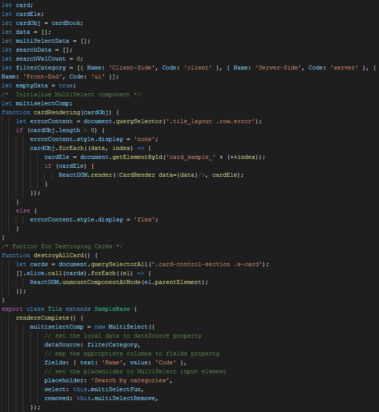
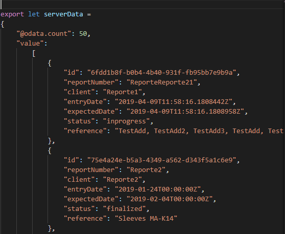

# 3. Tecnologías utilizadas

## 3.0. JavaScript
Principalmente, al inicio del proyecto, todo el código estaba compuesto por este lenguaje.

"JavaScript es un lenguaje de programación que te permite realizar actividades complejas en una página. Se trataría del tercero de los estándares en las tecnologías para la web, dos de las cuales son (HTML y CSS).

Permite crear contenido nuevo y dinámico, controlar archivos de multimedia, crear imágenes animadas y muchas otras cosas más." 

Simplemente he querido nombrarlo por encima ya que se trata de un lenguaje que hemos estado viendo a lo largo del curso en el instituto. De todas formas, no está de más mencionarlo ya que ha sido desde el principio la base de todo el componente pese a que al final el lenguaje pasase a ser otro. Bajo muestro una imagen del código base programado con JS, a partir del cual nace mi componente:

(Imagen 4: Trozo de código JS del componente)

## 3.1. TypeScript
"TypeScript es un lenguaje de programación de código abierto desarrollado por Microsoft, el cual cuenta con herramientas de programación orientada a objetos.

Este convierte su código en JavaScript común. Es llamado también Superset de JavaScript, lo que significa que, si el navegador está basado en JavaScript, este nunca llegará a saber que el código original fue realizado con TypeScript y ejecutará el JavaScript como lenguaje original.

Decimos que una tecnología es un superset de un lenguaje de programación, cuando puede ejecutar programas de la tecnología, Typescript en este caso, y del lenguaje del que es el superset, JavaScript en este mismo ejemplo. En resumen, esto significa que los programas de JavaScript son programas válidos de TypeScript, a pesar de que TypeScript sea otro lenguaje de programación."

De todas formas, apenas me costó de aprender su funcionamiento ya que el uso que le di fue para tipar los datos, las funciones… Entendiendo por tipar, el hecho de decirle a una variable que tipo de valores va a manejar, que tipo de valores devolverá una función, etc.: 

## 3.2. React
"Es una librería JavaScript de código abierto para crear interfaces de usuario con el objetivo de animar al desarrollo de aplicaciones de una sola página. Ayuda a los desarrolladores a construir aplicaciones que usan datos que cambian constantemente.

El objetivo principal de esta librería es ayudar a los desarrolladores en la creación de aplicaciones web de una manera más ordenada y con menos código del que escribiríamos si creásemos nuestra aplicación con JS puro u otras librerías como podría ser JQuery." 

Como mencioné anteriormente, en un principio el lenguaje principal de mi proyecto era JS, pero al cambiar a TS también incluí la librería de React ya que es una de las principales herramientas con las que se trabaja en la empresa. Tal vez, junto con los tests los cuales se explicarán más adelante, este ha sido uno de los conceptos que más me costó entender al principio en las explicaciones. Al ir trabajando con la librería he ido comprendiendo cómo funcionaba esta y me he adaptado a su manera de trabajar. 

Actualmente, durante la realización de mi proyecto en mayo de 2019, estoy trabajando con la versión 16.8.0.

## 3.3. Redux 
Esta es una librería que no he acabado de acoplar al proyecto debido a la falta de tiempo pero que como he visto y trabajado unas semanas con ella mencionaré de todas maneras.

Para ponernos en situación, antes de intentar implementar redux en el componente, casi desde el principio, los datos que muestran las tarjetas estaban siendo tomados desde un fichero que tengo dentro de la estructura del proyecto.

Se trata de un fichero JS con todos los valores a mostrar:

(Imagen 5: Muestra de los datos que se están tomando para mostrar).

En la imagen superior tenemos un par de ejemplos de los datos. Estos son los que utiliza actualmente la aplicación para trabajar. 

Por ahora si quisiera trabajar con datos nuevos tengo dos opciones. O meto un nuevo fichero con los mismos campos que se mostrarán en tarjetas y así cambian los valores a mostrar. O la segunda opción es ir introduciendo nuevas entradas al final del actual fichero y este automáticamente creará tarjetas según los datos recibidos.

Esto estaría muy bien de no ser porque, al fin y al cabo, se espera que el componente tenga unos datos que puedan cambiar continuamente ya que aquí se trabaja con una gran cantidad de valores y no se podrían estar metiendo a mano. 

Llegados a este punto y para solucionar el problema, tendríamos redux. Esta herramienta o librería tiene una ventaja que permite que podamos trabajar con datos que vayan cambiando gracias a una propiedad conocida como estado.
Digamos que este estado se encarga normalmente de almacenar datos que recibe a través de un API REST o webService (en mi caso, el listado de los reportes).
Así que la finalidad de este es que cambiase la forma de tomar los datos.

## 3.4. Jest 

"Se trata de un framework que podría definirse como una plataforma de prueba universal, con capacidad para adaptarse a cualquier biblioteca o marco de JS. Es una herramienta con la que poder dar potencia y flexibilidad a nuestras pruebas, con una gran velocidad a la hora de usarlo, así como el hecho de permitir diferentes tipos de tests."

Durante la realización de este proyecto se está trabajando con la versión 23.6.0.

## 3.5. Enzyme

Podríamos explicar esta herramienta junto con la anterior debido a que se trata de una utilidad de test para pruebas con react, esta nos facilita mucho el hecho de realizar dichas pruebas a la hora de pasar el test, encontrar los errores de nuestro código... Digamos que su principal función es que jest pueda entender react ya que,en un principio, este está preparado para trabajar con JS y TS. Si incluimos enzyme junto con Jest entonces si puede interpretar react.

Algo importante a remarcar es que enzyme trabaja con distintas versiones de react, por lo cual, necesita saber que versión vamos a usar, para esto, existe un fichero de configuración que se encarga de controlar esto. 
 

(Imagen 6: Fichero con la configuración de adapter).

Estoy trabajando con la versión 3.9.0.

## 3.6. NodeJS

La manera más sencilla de definir nodeJS sería: "Es un entorno JavaScript de lado de servidor que utiliza un modelo asíncrono y dirigido por eventos. Su principal función es la de ser útil en la creación de programas de red escalables, el mejor ejemplo sería un servidor web".
Se ha hecho popular debido a su versatilidad. Dispone de utilidades que nos permiten trabajar y automatizar tareas para llevar a cabo el desarrollo de aplicaciones orientadas a redes de comunicación.

Estoy trabajando con la versión 10.15.3.

## 3.7. i18n 

A la hora de crear una aplicación que pueda estar enfocada a personas de diferentes nacionalidades, uno de los principales problemas que encontraremos será el hecho de afrontar que no todas van a comunicarse en el mismo idioma. En este caso, al programar dicha aplicación o página web nos encontraremos con la necesidad de proporcionar la internalización para nuestros usuarios de los textos, mensajes, avisos... que aparezcan en ella. 

Para llevar a cabo dicha tarea, actualmente contamos con una herramienta conocida por el nombre de i18n. Se trata de una librería de javascript que tiene la finalidad de facilitarnos ese proceso de internalización.

Para que un componente pueda utilizar la internalización deber de estar envuelto por él, esto lo conseguimos gracias a esta sentencia.

(Imagen 7: Envolviendo componente de cardRender).

## 3.8. Moment JS

Se trata de una librería de JS que tiene como finalidad ayudarnos a solventar los problemas que puedan surgir con las fechas que utilicemos en nuestra web. 
Gracias a esta librería, tenemos una gran cantidad de opciones a realizar entre fechas:

- Formatear fechas para adaptarlas a diferentes localizaciones por idioma o cultura.

- Trabajar con horas, mostrar estas en diferentes formatos.

- Trabajar con fechas, visualizar estas en diferentes formatos.

- Preparar contadores de tiempo y controlar el tiempo que ha pasado entre dos fechas.

Entre otras opciones.

## 3.9. Webpack
Podríamos definir Webpack como un empaquetador de módulos, este permite la generación de un archivo único que posea todos los módulos que nuestra aplicación necesita para funcionar. Para que quede algo más claro, este permite meter todos los archivos JS que tengamos en un mismo archivo. La manera más básica y sencilla para entender cómo funciona sería el compararlo con un ejecutable .EXE el cual encontraríamos a la hora de instalar un programa, al ejecutarlo, este realiza las tareas necesarias por sí mismo para llevar a cabo la instalación del programa.

Además de encargarse de empaquetar módulos, este puede llevar a cabo muchas más acciones:

- Gestionar dependencias.

- Ejecutar tareas.

- Conversión de formatos.

- ...

De todas formas, también posee bastantes inconvenientes ya que se trata de un programa que puede resultar complejo tanto por su código fuente, como por la documentación, la cuál es bastante pobre. 

## 3.10. esLint

“Los linters son una herramienta. Estas tienen como función base, analizar nuestro código, y a partir de una serie de reglas definidas por nosotros (o podemos extenderlas de otras ya predefinidas) nos va a mostrar los errores que estamos cometiendo en nuestro código.”.

Según lo que estoy entendiendo yo por la definición superior, se trataría de una herramienta que nos ayudará a encontrar los posibles errores de escritura que podamos producir en nuestro código mientras programamos. Permite controlar el estilo, mostrarnos bugs... En general, controlar lo que escribimos y ayudarnos a mejorar el código. 

En este caso, esLint sería un linter. Existen una gran cantidad de ellos y cada uno puede ir enfocado a un lenguaje en concreto, por ejemplo, tsLint para TypeScript, StyleLint para estilos o esLint para JavaScript que es el que yo estoy usando.

Para un lenguaje como es JS el cuál podríamos definir como "dinámico" y que permite una gran cantidad de maneras de escribir el código, esLint puede ayudarnos mucho para problemas que puedan pasarse por alto, así como llegar a avisarnos de fallos sin necesidad de ejecutar el código para así poder solucionar estos de forma manual. En ocasiones, el propio programa podrá encargarse de solucionar el error automáticamente. 

La ventaja es que se nos permite crear nuestras propias reglas, así como utilizar las que ya vienen definidas. Esto permite llevar a cabo lo mencionado anteriormente. 

Para que la corrección sea mucho más cómoda, cuenta con un comando que permite lanzar una vista, la cual nos notifica exactamente qué nos aconseja cambiar el programa según las normas que tiene este configuradas. Nos indicará la línea y cuál es el error que debemos solucionar.
Más abajo explicaré como acceder a dicha vista.
 

(Imagen 8: Logo ESLint).
