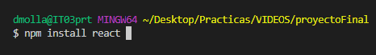
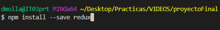
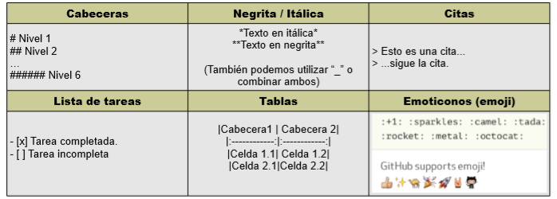
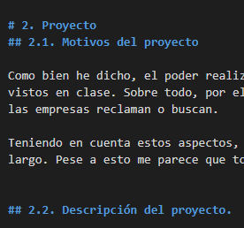
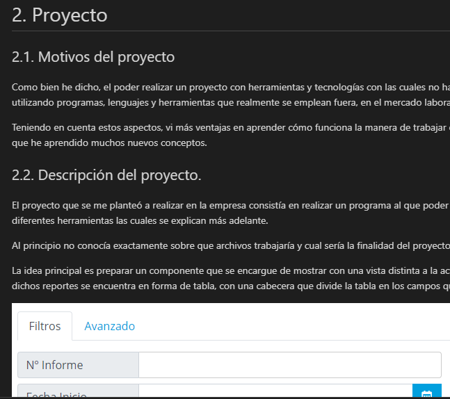
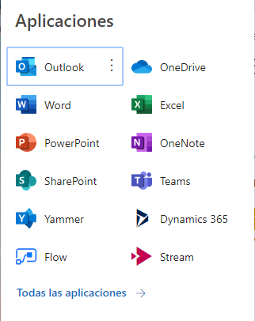
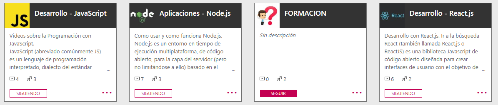
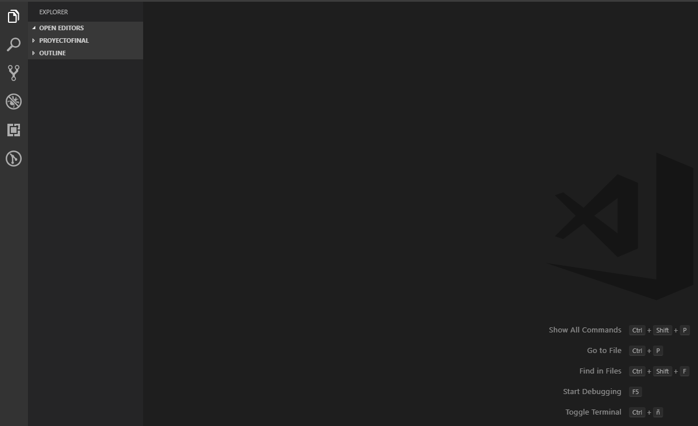
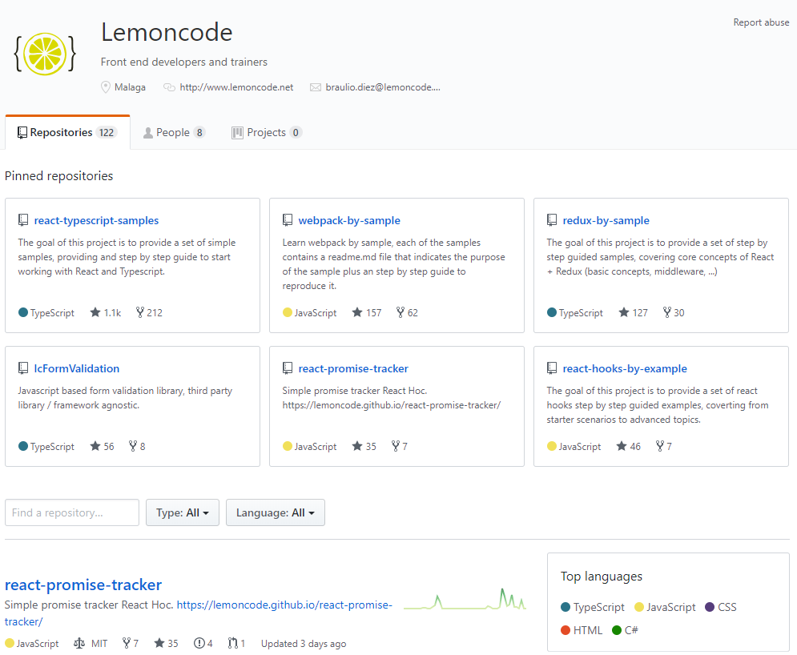

# 4. Otras herramientas / tecnologías

## 4.0. NPM 

A lo largo de la realización del proyecto, ha sido necesaria la instalación de los paquetes mencionados en el punto anterior, para ello he utilizado un gestor de paquetes.

Existen bastantes más gestores de paquetes, pero en este caso nos centraremos en el más importante hasta la fecha el cual lleva el nombre de NPM. Se trata de un gestor enfocado tanto al frontEnd como al backEnd y es una de las razones por las cuales es sino el más popular, de los más populares, ya que muchos no se centran en ambas partes.

La finalidad de utilizar NPM es hacer que trabajar con nodeJS (mencionado más arriba) sea mucho más sencillo. Esto es debido a que nos permite instalar librerías enteras con una sola línea de código. Ayuda a administrar módulos, distribuir paquetes, agregar dependencias... 

A continuación, pondré un par de ejemplos para instalar alguno de los paquetes superiores:

(Imagen 9: Línea de comando para instalar el paquete de React).

(Imagen 10: Línea de comando para instalar el paquete de Redux).

Como podemos observar, es muy sencillo de usar npm para realizar acciones de instalación, más adelante explicaré otros usos posibles.

## 4.1. MarkDown
A la hora de realizar la documentación de este proyecto, comencé utilizando un simple editor de textos como bien puede ser el Word, el cual al finalizar tenía pensado pasar a PDF una vez estuviera finalizada dicha documentación.

Finalmente, en la empresa se me aconsejó utilizar la herramienta conocida por el nombre de MarkDown. Se trata de un lenguaje de marcado ligero y su finalidad es facilitar la publicación de contenido ya que permite que el resultado sea mucho mejor redactando de una manera mucho más rápida. La idea es que una vez el proyecto está terminado, realizar la documentación en GitHub utilizando MarkDown para su edición.

(Imagen 11: Sintaxis de MarkDown).

A continuación, se muestra una imagen con el editor de textos que posee MarkDown para Visual Studio Code, seguida de otra que mostrará el visualizador de contenido, es un apartado muy útil ya que puedes observar cómo va siendo el resultado del documento que estás redactando:

Podemos observar que las dos imágenes pertenecen a la misma parte de código y cuál es el resultado. 

(Imagen 12: Editor de MarkDown).
 

(Imagen 13: Visualizador de MarkDown).

## 4.2. Office 365
Una de las herramientas que tiene la empresa y que, junto con la siguiente, serían de lo que más he utilizado es Office 365. Además, al principio de mi estancia aquí recibí un curso para aprender su uso.

Se trata de un programa o herramienta la cual distribuye Microsoft de pago, enfocada principalmente tanto para uso personal y sobre todo a empresas. Su tuviera que explicarlo según lo que yo he podido probar de ella, sería como tener una gran cantidad de aplicaciones a simplemente un click. Esto se debe a que disponemos desde aplicaciones básicas para cualquier empresa como bien podría ser Word, Excel, el servicio de mensajería de Outlook...

(Imagen 14: Herramientas que permite usar Office 365).

Hasta herramientas menos conocidas como Teams (sería algo similar a un Skype para empresas donde poder comunicarse con más facilidad que por correo), Yammer (similar a un Facebook) o Stream (la que más he utilizado yo durante mi periodo de prácticas y sobre todo durante el primer mes de formación aquí).

Esta última sencillamente es una plataforma desde la que poder compartir todo tipo de videos que suban los empleados, pero enfocada a trabajo, ya sea para compartir tutoriales, conferencias grabadas...

Y digo que esta es la que más he usado ya que los tutoriales de formación que se me facilitaron desde el principio por el departamento de informática se encontraban aquí. 
 

(Imagen 15: Plataforma de videos)

## 4.3. Visual Studio Code (VSC)
Junto con Office 365, Visual Studio Code sería la herramienta más importante que he utilizado durante las prácticas ya que al fin y al cabo es el programa con el que he escrito todo el código de mi componente.

Al fin y al cabo, no deja de ser un programa para poder escribir líneas de código como podría haber sido cualquier otro, por lo que no hay mucho que explicar. Una de las ventajas que sí que he visto a la hora de utilizarlo es el hecho de tener un apartado desde el que instalar diferentes plugins de una manera muy sencilla.

Algunos de los que he instalado serían los siguientes:

- FileIcons: resulta de bastante utilidad ya que según el tipo de archivo tendrá un icono u otro. Esto ayuda a la hora de visualizar los archivos en la estructura de directorios de VSC.

- ESlint: explicado arriba. (Ayuda a la hora de programar).

- MarkDown: explicado arriba. (Utilizado para la documentación del proyecto).

Además de los plugins, un apartado que debería mencionar sería también el de la consola que posee ya que a la hora de lanzar el componente para ver si funciona o los tests también ha sido de mucha ayuda. Por ejemplo, MarkDown también utiliza comandos del terminal para exportar la documentación que crees en diferentes formatos.

(Imagen 16: Interfaz VSC).

## 4.4. Documentación de LemonCode
Para acabar con el apartado de recursos que he utilizado o se me han ofrecido, creo que no estaría de más mencionar los cursos de LemonCode, ya que aproximadamente durante mis primeras 60-70 horas aquí en la empresa estuve aprendiendo a trabajar con todas y cada una de las diferentes librerías, herramientas, programas...

Todo esto ha sido posible gracias a dichos cursos, los cuales se me han sido proporcionados en formato de video principalmente. Además de poder ver cada curso, he contado también con el apoyo de la explicación y documentación en formato de texto e imágenes, que los mismos creadores de LemonCode tienen para la disposición de todo el mundo en su GitHub y a los cuales se puede acceder de manera completamente gratuita.
[GitHub de LemonCode]
 

(Imagen 17: GitHub de LemonCode).

